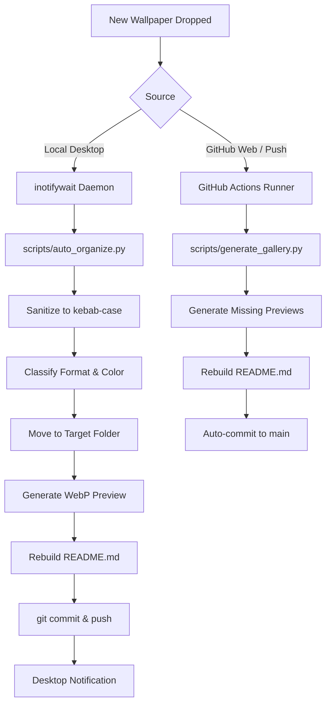

# System Overview & Architecture

An automated, curated desktop wallpaper repository paired with a zero-touch ingestion pipeline, deterministic color-shade categorization, and high-performance WebP thumbnail generation.

---

## 1. Project Philosophy & Design Principles

1. **Uncompressed Asset Preservation**: Master wallpaper assets (4K, 5K, 8K, pixel art GIFs, and MP4 live wallpapers) are stored in their native formats without lossy compression or resolution downsampling.
2. **Instant Visual Browsing**: Rather than loading hundreds of megabytes of raw files when viewing the repository, lightweight WebP previews (capped at 640px width, ~25 KB average) are generated incrementally, keeping total thumbnail payload under 7 MB.
3. **Deterministic Color Sorting**: Static wallpapers are categorized based on algorithmic HSV color distribution rather than subjective genre tags.
4. **Strict Uniform Naming**: All assets adhere to lowercase `kebab-case.ext` conventions with no special characters, timestamps, camera hashes, or language-specific scripts.
5. **Zero-Touch Automation**: New wallpapers placed in the repository root are automatically ingested, classified, renamed, previewed, and committed to Git by background daemons or GitHub Actions CI.

---

## 2. Directory Structure

```text
walpp/
├── .github/
│   └── workflows/
│       └── update-gallery.yml      # CI workflow for cloud preview generation
├── scripts/
│   ├── auto_organize.py            # Automated ingestion, classification & sync
│   ├── generate_gallery.py         # WebP preview generator & README table builder
│   ├── update-gallery.sh           # Manual one-command gallery refresh runner
│   ├── wallpaper_watcher.sh        # inotifywait event daemon
│   └── wallpaper-watcher.service   # Systemd user service unit definition
├── previews/                       # Generated WebP thumbnails (mirrors category structure)
├── dark/                           # Low-luminance, OLED black, cyber-noir, midnight
├── blue/                           # Azure, arctic Nord, cyan, alpine lakes, clear skies
├── warm/                           # Sunset amber, fiery crimson, golden autumn, warm glows
├── purple/                         # Synthwave magenta, violet twilight, lavender
├── green/                          # Verdant meadows, mossy waterfalls, pastoral landscapes
├── light/                          # High-key minimal compositions, zen ink, watercolor
├── gifs/                           # Animated pixel art, lofi chill loops, 16-bit retro
├── videos/                         # Ultra-HD live MP4 wallpapers for video backends
├── LICENSE                         # MIT License
├── README.md                       # Visual showcase gallery and client setup guide
└── OVERVIEW.md                     # System architecture & maintenance documentation
```

---

## 3. Color Classification Pipeline

Static images are classified into shade categories using raw 32×32 pixel HSV analysis:

```text
[Input Image] ───► [Scale to 32x32 RGB] ───► [Convert to HSV]
                                                    │
                   ┌────────────────────────────────┴────────────────────────────────┐
                   ▼                                                                 ▼
        [Brightness / Luminance]                                            [Chromatic Weight]
     Avg Value < 0.20 or >65% Black                                    Sum of (Saturation × Value)
                   │                                                                 │
                   ├─► "dark"                                                        ├─► Hue < 65° / > 335° ──► "warm"
                   │                                                                 ├─► Hue 65°–165°        ──► "green"
     Avg Value > 0.75, Low Saturation                                                ├─► Hue 165°–260°       ──► "blue"
                   │                                                                 └─► Hue 260°–335°       ──► "purple"
                   └─► "light"
```

- **Dark**: High density of pixels with Value < 0.22 or overall dark luminance.
- **Light**: Predominantly high brightness (Value > 0.75) with minimal saturation (< 0.25).
- **Hue-Dominant (Warm / Green / Blue / Purple)**: Pixels vote for their respective color bins weighted by Saturation × Value, preventing neutral dark or light areas from skewing chromatic classification.
- **Format Overrides**: Animated files (`.gif`) and video files (`.mp4`) are automatically routed to `gifs/` and `videos/` respectively, bypassing color classification.

---

## 4. Automation & Ingestion Architecture

The repository supports dual-layer automation: local event-driven daemon execution and remote GitHub Actions CI.



### Automation Components

| Component | Responsibility |
| :--- | :--- |
| **`scripts/generate_gallery.py`** | Scans category directories, extracts dimensions and aspect ratios via ImageMagick/FFprobe, incrementally builds WebP thumbnails in `previews/`, and renders the markdown table in `README.md`. |
| **`scripts/auto_organize.py`** | Ingestion worker. Handles name sanitization, HSV color classification, file relocation, preview generation, and background Git synchronization. |
| **`scripts/wallpaper_watcher.sh`** | Lightweight bash daemon utilizing `inotifywait` to monitor repository directories for file close/move events. |
| **`wallpaper-watcher.service`** | Systemd user service ensuring continuous, headless background operation of the watcher daemon across user sessions. |
| **`update-gallery.yml`** | GitHub Actions workflow ensuring thumbnail parity and gallery updates when commits are pushed directly from remote clients. |

---

## 5. Maintenance & Operation

### Running the Local Watcher
The local watcher service runs as a systemd user unit:

```bash
# Check service health
systemctl --user status wallpaper-watcher.service

# View real-time ingestion logs
journalctl --user -u wallpaper-watcher.service -f

# Restart or stop daemon
systemctl --user restart wallpaper-watcher.service
systemctl --user stop wallpaper-watcher.service
```

### Manual Gallery Regeneration
If thumbnails or markdown tables need to be rebuilt manually:

```bash
./scripts/update-gallery.sh
```

---

## 6. Client Integration & Desktop Usage

Wallpapers can be queried and set dynamically by Linux window managers and display tools:

### Hyprland (`hyprpaper`)
```ini
preload = ~/Pictures/Wallpapers/dark/pure-black-minimal.jpg
wallpaper = ,~/Pictures/Wallpapers/dark/pure-black-minimal.jpg
```

### Smooth Transitions (`swww`)
```bash
swww img ~/Pictures/Wallpapers/blue/monterey-nord-dunes.png --transition-type wipe
```

### Live Video Wallpapers (`mpvpaper`)
```bash
mpvpaper '*' ~/Pictures/Wallpapers/videos/cracked-screen-cat.mp4 -o 'loop --no-audio'
```

### Sparse Checkout (Single Category Clone)
To download only specific categories without fetching the entire repository:

```bash
git clone --filter=blob:none --sparse git@github.com:Realdhiru/wallps.git ~/Pictures/Wallpapers
cd ~/Pictures/Wallpapers
git sparse-checkout set dark blue   # only checkout dark and blue folders
```
